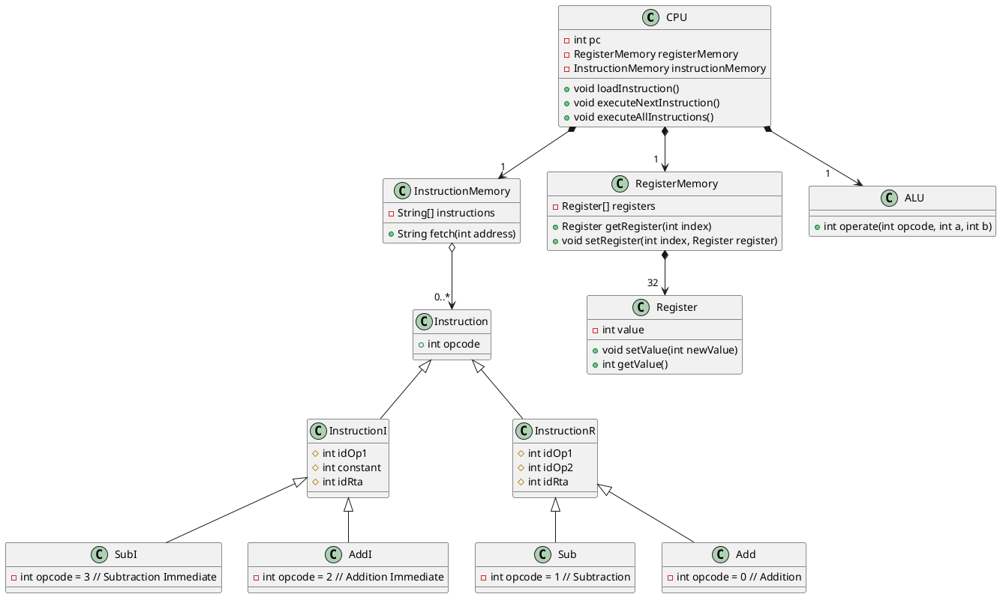

##CPU

Implementation for a CPU based on the UML

# PlantUML code:

# Funcionamiento

Aquí tienes una explicación sencilla del funcionamiento del sistema que representa este diagrama UML:

1. **CPU (Unidad Central de Procesamiento)**: La CPU es el "cerebro" del sistema. Su trabajo principal es ejecutar las instrucciones que están almacenadas en la memoria de instrucciones y manipular datos usando la ALU (Unidad Aritmética y Lógica) y los registros.

    - **loadInstruction()**: La CPU carga una instrucción desde la memoria de instrucciones.
    - **executeNextInstruction()**: Ejecuta la siguiente instrucción cargada.
    - **executeAllInstructions()**: Ejecuta todas las instrucciones almacenadas en la memoria de instrucciones, una por una.

2. **InstructionMemory (Memoria de Instrucciones)**: Es un lugar donde se almacenan las instrucciones que la CPU debe ejecutar. Cada instrucción tiene una dirección específica. La función fetch(int address) permite obtener una instrucción de una dirección dada.

3. **RegisterMemory (Memoria de Registros)**: Los registros son pequeños espacios de almacenamiento dentro de la CPU que guardan datos temporales. La CPU usa estos registros para realizar cálculos. Hay varias operaciones para acceder a estos registros, como getRegister(int index) para obtener un registro y setRegister(int index, Register register) para modificar un registro.

4. **Instruction (Instrucción)**: Cada instrucción tiene un código de operación (opcode) que indica qué tipo de operación debe realizar la CPU. Hay dos tipos principales de instrucciones:

    - **InstructionI**: Estas son instrucciones inmediatas, donde se usa un valor constante.

        Esta clase se refiere a un tipo de instrucción que trabaja con un valor constante además de uno o más registros. Las instrucciones inmediatas son útiles para operaciones donde necesitas trabajar con un número fijo en lugar de otro valor almacenado en un registro. Sus partes son:
    
        **idOp1**: Este es un identificador que indica cuál es el primer operando o el registro de entrada. Por ejemplo, puede referirse a un número de registro en la memoria de registros.   
        **constant**: Este es el valor constante (inmediato) con el que se va a trabajar. No cambia durante la ejecución de la instrucción.   
        **idRta**: Este es el identificador del registro de resultado, donde se almacenará el valor calculado después de ejecutar la operación.   
        Ejemplo: Si la instrucción es AddI, entonces sumará el valor del registro identificado por idOp1 con el valor constante y almacenará el resultado en el registro identificado por idRta.   

    - **InstructionR**: Estas instrucciones operan sobre dos registros.
  
        Esta clase representa instrucciones que operan sobre dos registros, es decir, no usa valores inmediatos, sino que toma valores directamente de los registros de la CPU. Estas instrucciones son muy comunes para realizar cálculos entre dos valores almacenados en diferentes registros. Sus partes son:

        **idOp1**: Es el identificador del primer operando, es decir, el primer registro involucrado en la operación.   
        **idOp2**: Es el identificador del segundo operando, que es otro registro.   
        **idRta**: Es el identificador del registro donde se almacenará el resultado de la operación.   
        Ejemplo: Si la instrucción es Sub, la CPU restará el valor del registro identificado por idOp2 al valor del registro identificado por idOp1 y almacenará el resultado en el registro indicado por idRta.   

5. **Instrucciones específicas**:
 
    - **Add (Suma) y AddI (Suma Inmediata)**: Realizan operaciones de suma. La Add suma dos registros, mientras que la AddI suma un registro y un valor constante.   
    - **Sub (Resta) y SubI (Resta Inmediata)**: Realizan operaciones de resta, con Sub restando dos registros y SubI restando un registro y un valor constante.   
    - **ALU (Unidad Aritmética y Lógica)**: La ALU es la parte de la CPU encargada de realizar cálculos aritméticos (como sumar o restar). La función operate(int opcode, int a, int b) realiza la operación indicada por el opcode usando los valores de entrada.
  
6. **Ejemplo de Funcionamiento**:
    Supongamos que queremos sumar el valor de un registro con un número constante usando una InstructionI:
    
    La CPU carga la instrucción AddI con:   
    idOp1 = 2 (que representa el segundo registro de la memoria de registros).   
    constant = 5 (el valor constante).   
    idRta = 1 (donde se guardará el resultado).   
    La CPU toma el valor del registro 2 del RegisterMemory, lo pasa a la ALU junto con el número 5, obtiene el resultado y lo manda a la RegisterMemory para almacenar el registro 1.   
    
    Para una InstructionR como Sub:   
       
    La CPU carga la instrucción Sub con:   
    idOp1 = 3 (el tercer registro de la memoria de registros).   
    idOp2 = 4 (el cuarto registro).   
    idRta = 1 (donde se guardará el resultado).   
    La CPU obtiene los valores de los registros 3 y 4 del RegisterMemory, los manda a la ALU, la cual resta los valores, la CPU manda el resultado a la RegisterMemory para ser almacenado en el registro 1.   
    
    Ambas instrucciones ayudan a realizar operaciones aritméticas, pero InstructionI utiliza valores constantes, mientras que InstructionR trabaja solo con registros.

En resumen, la CPU sigue un ciclo en el que carga instrucciones de la memoria, las ejecuta usando los registros y la ALU, y guarda los resultados de las operaciones en los registros. Las instrucciones pueden ser de suma o resta, y algunas usan valores constantes mientras que otras operan sobre dos registros.

# Indicaciones sobre el parcial

Durante el parcial es prohíbido el uso de cualquier tipo de material de consulta, incluyendo libros, apuntes, internet, etc. El parcial es individual y cualquier intento de copia o fraude será penalizado. No se permite el uso de asistentes de programación como COPILOT o chatGPT. Cualquier duda o aclaración, por favor preguntar al profesor.
Los casos de prueba no pueden ser editados, ni se pueden agregar o quitar casos de prueba. Si se hace, el parcial será anulado y se considerará como copia. Si hay algún error en los casos de prueba, por favor notificar al profesor.

